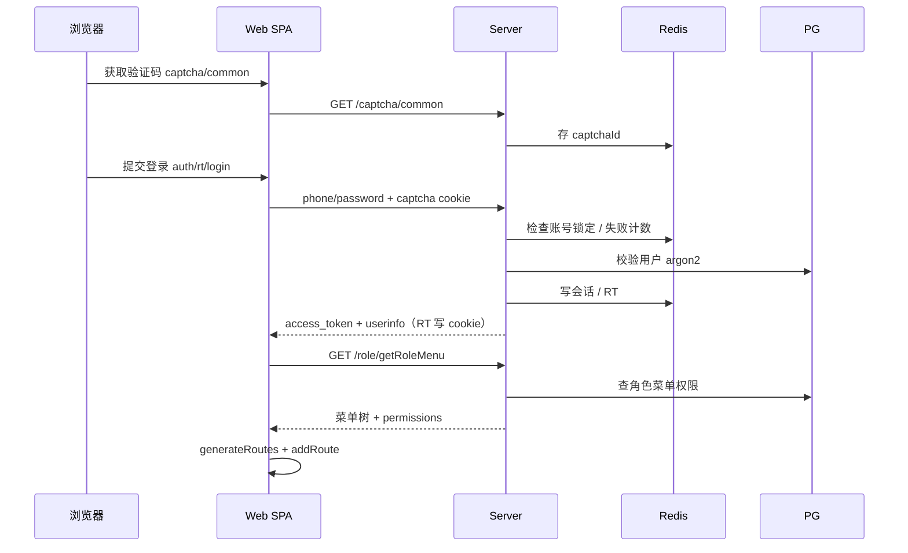
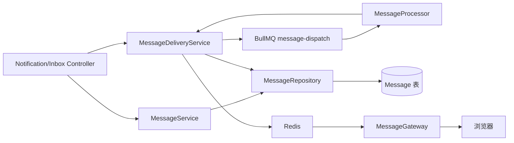

# 数据流

## 登录与动态菜单

## 鉴权业务请求

1. Axios 附加 `Authorization: Bearer <access_token>`
2. Nginx（生产）去掉 `/api` 前缀
3. Nest：限流 → JWT → PermissionGuard（Redis 权限缓存，未命中走 User 仓储）
4. Service 访问 Prisma / Redis
5. TransformInterceptor 将载荷包装为 `ResOp`；失败走 AllExceptionsFilter，禁止业务层 `return { code }`

## Token 刷新

- Access token 只放 Pinia 内存，不写 localStorage；刷新页由路由守卫先用 cookie `rt` 换新 access，再拉 userInfo / 菜单
- 业务响应 401/406 → 独立请求 `POST /auth/refresh`（`withCredentials`）；无内存 access 时也会尝试
- 成功：更新 Pinia token 并重试原请求
- 登录 / 注册 / 验证码失败不会走 refresh
- Refresh 仍 401：若当时已有内存 access 则清空登录态跳转登录页
- 刷新基础设施错误（500/503）保留登录态，不强制踢出

## 站内消息派发

消息任务 3 次指数退避；`(dispatchId, receiverId)` 唯一约束保证幂等。

## 在线用户 / 监控

- 登录后前端建立 `/online/ws`、`/monitor/ws`（经 `/api` 反代）
- 会话吊销由 `SessionModule` 发领域事件；`OnlineModule`（Presence）监听后清 Redis 并通知 Gateway
- 监控快照：`GET /monitor/snapshot`（权限 `server:view`）

## 文件上传

- 普通上传：`POST /staticfile/upload`
- 分片上传：`/staticfile/uploads/initiate` → `PUT .../chunks/:index` → `complete` / `abort`
- 头像：`POST /user/upload/avatar`
- 静态文件由独立中间件按 `STATIC_FILE_ROOT_PATH` 前缀提供（磁盘目录示例：`public`，对外 URL 示例：`api/public`）
- `File` 元数据由 Staticfile 管理（软删）；磁盘 unlink 由 FileCleanup 队列执行
- OSS 走预签名，不经过本地磁盘；见 [oss.md](../modules/oss.md)

## 访问日志与操作日志

- 访问日志：`OperationLogInterceptor` 记录 HTTP 请求到 `UserOperationLog`（可查可删）
- 操作日志：业务 Service 成功后调用 `AuditLogService.record()` 写入 `AuditLog`（可查不可删）
- 写 IP 时尝试离线解析城市级地理位置并写入 `location`（内网为「内网IP」）。`ip2region-ts` 当前未列入依赖，解析失败会退回「未知」
- 查询：`/log/getUserOperationLogList`、`/log/getAuditLogList`（`category=login` 为登录日志）；删除仅访问日志 `/log/deleteUserOperationLog`
