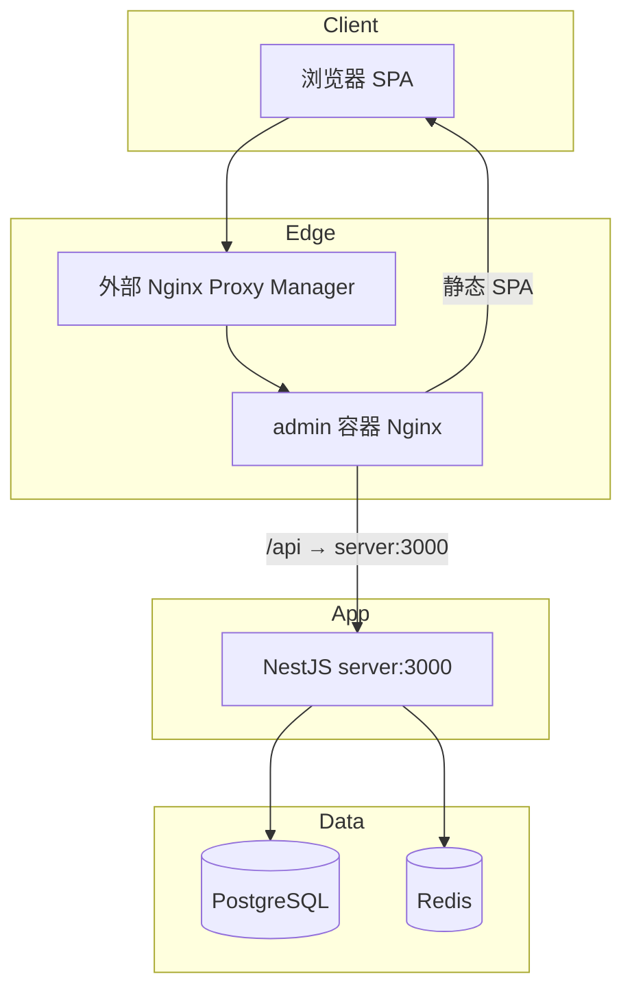
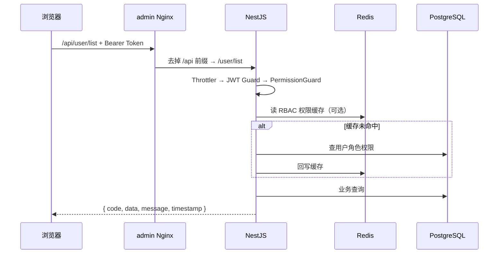

# 系统架构

## 项目简介

本仓库是一套 **后台管理系统**（根包名 `xzz-vue3-nestjs11-admin`），面向需要 RBAC 权限、组织架构、运维监控与站内消息的管理场景。

| 项       | 说明                                                                         |
| -------- | ---------------------------------------------------------------------------- |
| 定位     | 企业后台：用户/角色/菜单/权限 + 部门字典 + 文件/OSS/日志/在线用户/监控/消息/备份 |
| 使用场景 | 管理端 SPA + 统一 API；生产经 Docker Compose + 外部反代访问                  |
| 技术选型 | NestJS 12、Prisma 7、PostgreSQL 18、Redis 8、Vue 3、Vite 8、Element Plus     |

## 逻辑架构

```
Vue3 SPA (apps/web)
  →  Nginx(/api 反代，Compose 服务名 admin)
  →  NestJS API (apps/server)
  →  Prisma 7 + pg adapter  →  PostgreSQL
       ↓
     Redis（会话 / 验证码 / RBAC 缓存 / 授权快照 / 限流 / 消息）
       ↓
     BullMQ（消息派发 / 文件清理 / 数据库备份）
```

### Mermaid：系统架构



### Mermaid：典型 HTTP 请求流



## 模块化设计

| 分层         | 路径                                         | 职责                                                                                          |
| ------------ | -------------------------------------------- | --------------------------------------------------------------------------------------------- |
| 核心基础设施 | `apps/server/src/core/`                      | Config、静态资源、Swagger、日志                                                               |
| 数据基础设施 | `apps/server/src/infrastructure/database/`   | Prisma/`PgService`、Redis、BullMQ 连接                                                        |
| 横切处理器   | `apps/server/src/processor/`                 | Guard / Decorator / Filter / Interceptor / RBAC 缓存 / DataScope 授权                         |
| 业务系统     | `apps/server/src/system/`                    | auth、session、user、role、menu、permission、department、dictionary、customer、message、online、monitor、captcha、staticfile、oss、db-backup |
| 数据模型     | `apps/server/prisma/`                        | Schema、migrations、seed                                                                      |
| 生成代码     | `apps/server/src/generated/`                 | Prisma Client、Zod DTO                                                                        |
| 管理前端     | `apps/web/src/`                              | views / api / store / router / permission                                                     |

`AppModule` 仅聚合 `CORE_MODULE` + `CORE_SYSTEM_MODULE`。`StaticfileModule` 挂在 `CORE_MODULE`，其余业务模块在 `app.system.ts`。

## 分层设计（后端）

```
Controller（HTTP / 权限装饰器）
    → Service（业务）/ Policy（数据范围）
        → Repository（部分模块）
            → PgService / Prisma Client（持久化）
            → Redis / BullMQ（缓存与异步）
```

当前并非所有模块都有 Repository：User / Role / Customer / Department / Message / Staticfile / DbBackup 已拆分；Permission、Dictionary 等仍由 Service 直接使用 `PgService`。

全局能力：

- 校验：`GlobalZodValidationPipe`
- 响应：`TransformInterceptor` → `ResOp` `{ code, data, message, timestamp }`
- 异常：`AllExceptionsFilter` 写出同一信封，HTTP status = `code`
- 操作日志：业务 Service 成功后 `AuditLogService.record()` → `AuditLog`
- 访问日志：`OperationLogInterceptor` → `UserOperationLog`

## 权限设计（摘要）

- 模型：用户 ↔ 角色 ↔ 菜单 / 权限（RBAC）
- 后端：`@RequiredPermission('resource:action')` + 全局 `PermissionGuard`
- 超管角色 `code === 'super_admin'` 视为拥有 `*`
- 数据范围：`AuthorizationService` + 资源 Policy（当前主要用于 Customer）
- 前端：服务端菜单动态路由 + `v-hasPermi` / Permission 组件

详见 [permission.md](./permission.md)。

## 扩展性

- 新增业务：在 `system/` 下新增 Module，注册到 `app.system.ts`
- 新增权限：菜单管理维护 Permission，角色分配后生效（含 Redis 缓存版本号）
- 新增前端页：`apps/web/src/views/` 落地组件，由服务端菜单 `component` 字段映射
- Schema 有 `Notice` 表，**当前无对应业务 Controller**
- `AuditLog` 由 `AuditLogService` 写入，列表接口 `GET /log/getAuditLogList`（权限 `auditLog:view`，无删除）

扩展步骤见 [extension-guide](../development/extension-guide.md)。

## 部署形态

- Compose 服务：`postgres`、`redis`、`migrate`（一次性）、`server`、`admin`
- **不暴露宿主机端口**；外部网络名 **`shared_net`**，由 NPM 反代到 `admin:80`（`/api` 由 admin Nginx 转到 server）
- 源码前端在 `apps/web`，生产镜像服务名仍是 `admin`

详见 [docker.md](../deployment/docker.md)。
