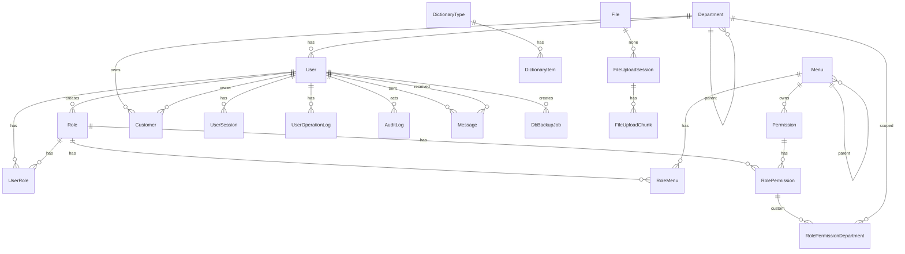

# 数据库设计

数据源：PostgreSQL。Schema：`apps/server/prisma/schema.prisma`（单文件）。配置：`apps/server/prisma.config.ts`（`PG_DATABASE_URL`）。

## ER 概览

## 模型说明

| Model                         | 要点                                                                                                         |
| ----------------------------- | ------------------------------------------------------------------------------------------------------------ |
| User                          | cuid；phone/email 唯一；argon2 密码哈希；`lastLoginIp` + `lastLoginLocation`；列表按 `createdAt desc`        |
| Role                          | code 唯一；`super_admin` 为超管约定；`isSystem`；`createdById` → User（SetNull）                             |
| UserRole                      | 复合主键 (userId, roleId)；`assignedById` → User（SetNull）                                                  |
| Menu                          | 树；`MenuType` DIRECTORY / MENU；path/name 唯一；内嵌前端 meta 字段                                          |
| Permission                    | code 唯一；挂 menuId；PermissionType                                                                         |
| RoleMenu / RolePermission     | 角色资源绑定；RolePermission 可带 DataScope                                                                  |
| RolePermissionDepartment      | CUSTOM_DEFINE 勾选的部门；部门 Restrict                                                                      |
| Department                    | 树 + 物化 `path`；`(parentId, name)` unique。PostgreSQL 普通 unique **允许多个 parentId=NULL 的同名根部门**  |
| Customer                      | owner / department / creator Restrict；decimal(18,2)；乐观锁 `version`                                       |
| DictionaryType / DictionaryItem | 字典；`(typeId, value)` 唯一                                                                               |
| Message                       | 站内信/系统/告警；`(dispatchId, receiverId)` 唯一                                                            |
| UserSession                   | tokenHash 唯一；过期时间；`ip` + `location`                                                                  |
| UserOperationLog              | 访问日志（HTTP 拦截器写入，可查可删）                                                                        |
| File                          | 文件元数据（自增 id）；`path` 唯一；`size` 为 BIGINT；软删除                                                  |
| FileUploadSession / Chunk     | 分片上传会话与分片                                                                                           |
| DbBackupConfig / DbBackupJob  | 备份计划（固定 id `default`）与任务记录                                                                      |
| Notice                        | 公告模型；**无 Nest Controller**                                                                             |
| AuditLog                      | 领域审计（Service 成功后写入；可查不可删；不记 GET）                                                         |

## 枚举

- `NoticeLevel`：INFO / SUCCESS / WARNING / ERROR
- `MenuType`：DIRECTORY / MENU
- `PermissionType`：BUTTON / DATA / API / FIELD / OTHER
- `MessageType`：MAIL / SYSTEM / ALERT
- `DataScope`：ALL / SELF / DEPT / DEPT_TREE / CUSTOM_DEFINE
- `CustomerStatus`：LEAD / FOLLOWING / WON / FROZEN
- `BackupTrigger`：MANUAL / SCHEDULED
- `BackupStatus`：RUNNING / SUCCESS / FAILED / EXPIRED
- `FileUploadStatus`：INITIATED / UPLOADING / COMPLETING / COMPLETED / ABORTED / EXPIRED / FAILED

## 账户与连接（生产）

Compose 区分三类 Postgres 用户：

| 用途     | 环境变量                                                      | 注入方式                                      |
| -------- | ------------------------------------------------------------- | --------------------------------------------- |
| 超级用户 | `POSTGRES_ADMIN_USER` / `POSTGRES_ADMIN_PASSWORD`             | postgres 容器                                 |
| 迁移     | 宿主机 `.env` 的 `PG_DATABASE_URL`                            | migrate 容器 → 进程内 `PG_DATABASE_URL`       |
| 运行时   | 宿主机 `.env` 的 `APP_DATABASE_URL`                           | server 容器将其注入为进程内 `PG_DATABASE_URL` |

Nest / Prisma 运行时**只读 `PG_DATABASE_URL`**。初始化脚本：`docker/postgres/init-users.sh`。脚本不会自动校验三个密码互不相同。

## Seed

- 入口：`apps/server/prisma/seed/seed.ts`
- 数据：`prisma/seed/data.ts`（菜单/角色/部门/权限）+ `seed-admin.ts`（`SEED_ADMIN_*`）
- 客户样例：`prisma/seed/seed-customers.ts`；主入口里 `seedAdditionalData()` **默认注释**，空库不会自动灌客户
- 判定：`Menu.count() > 0` 则整次 seed 跳过（角色/部门/权限/管理员一并跳过）
- 命令：`pnpm --filter server prisma:seed`
- Seed 不写 RoleMenu / RolePermission；超管依赖后端对 `super_admin` 的 `*` 通配
